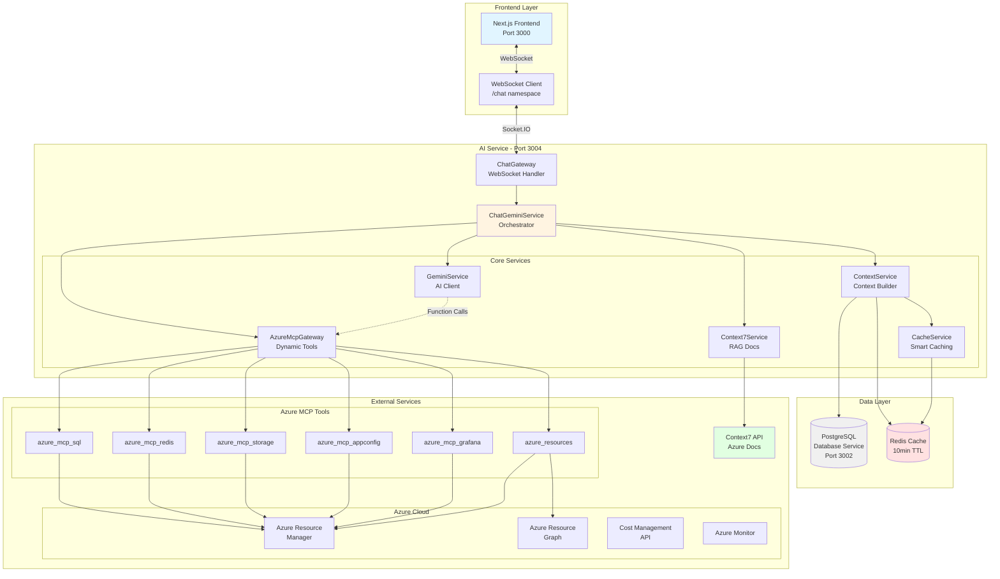
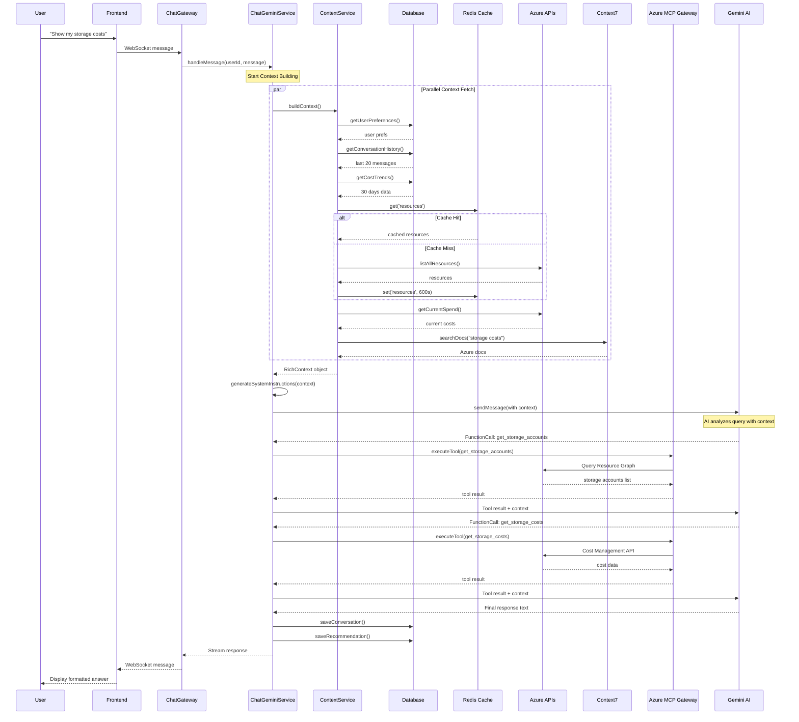
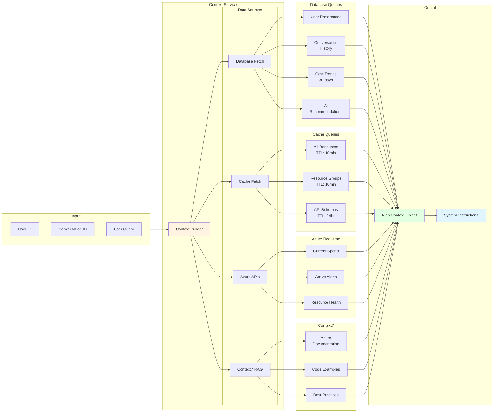
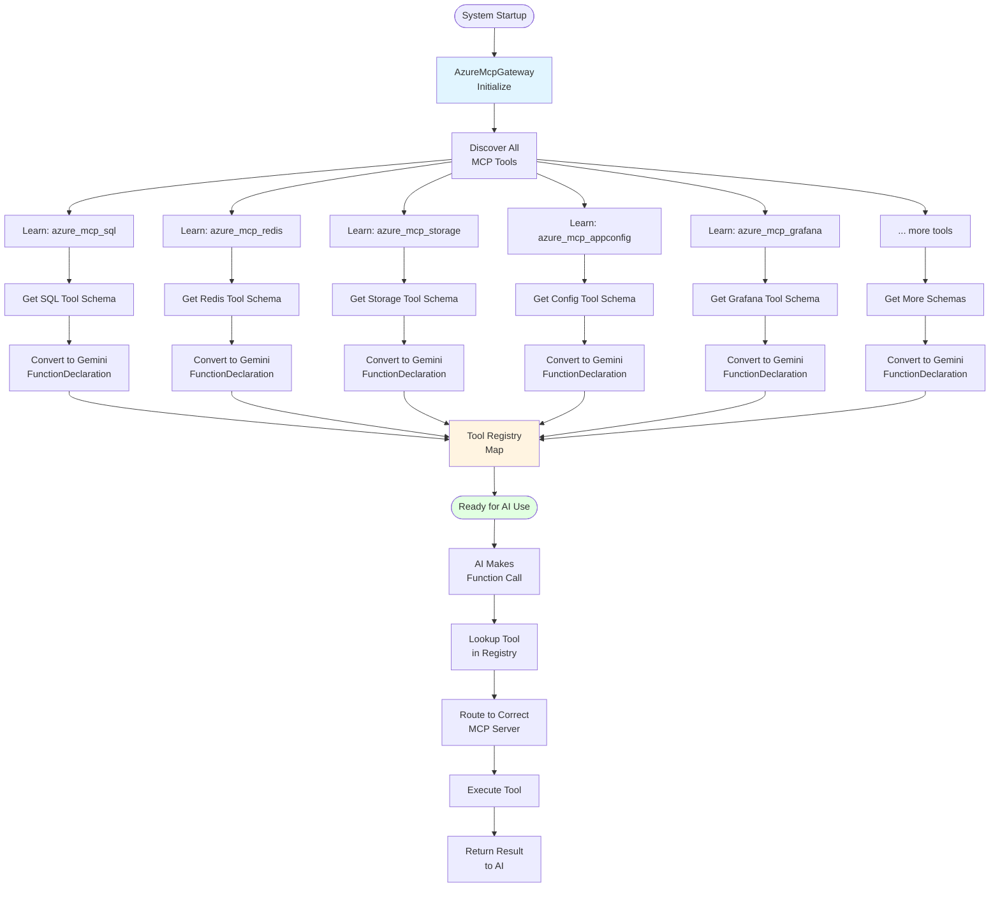
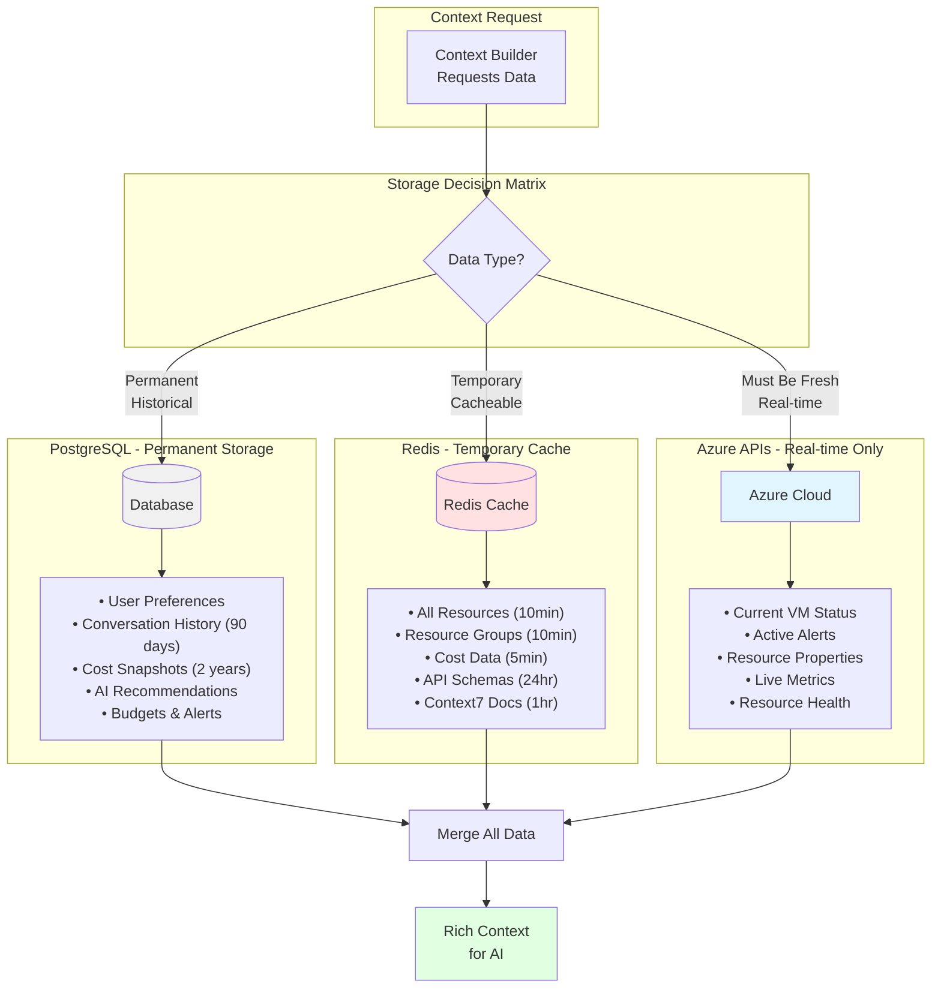
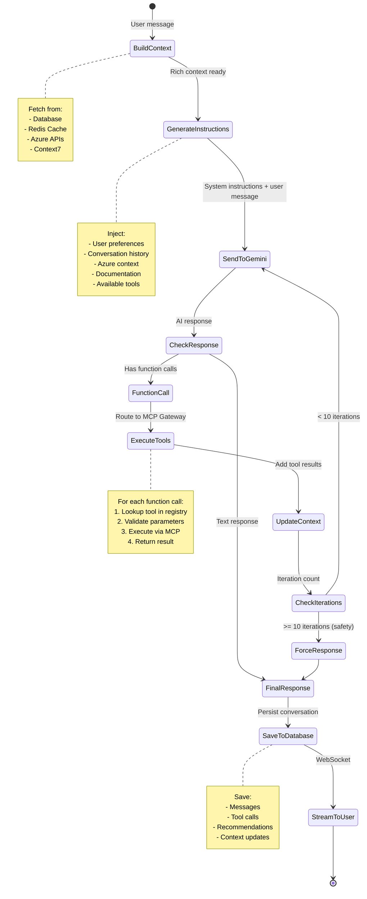
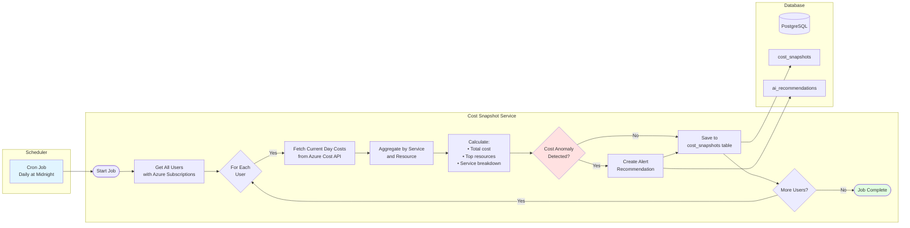
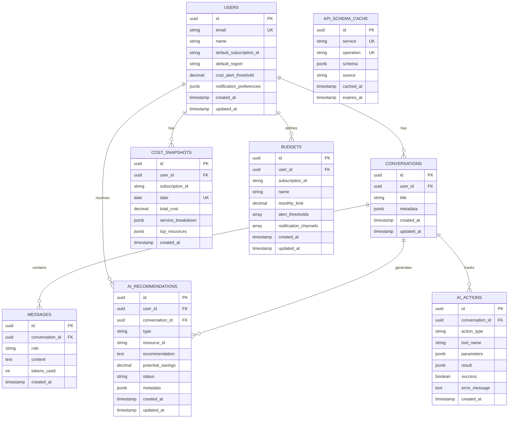
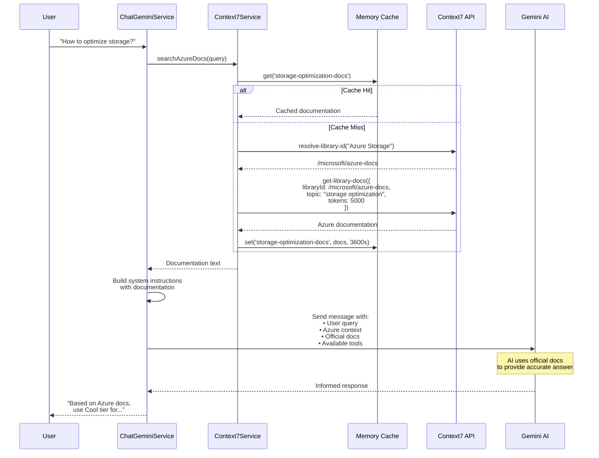
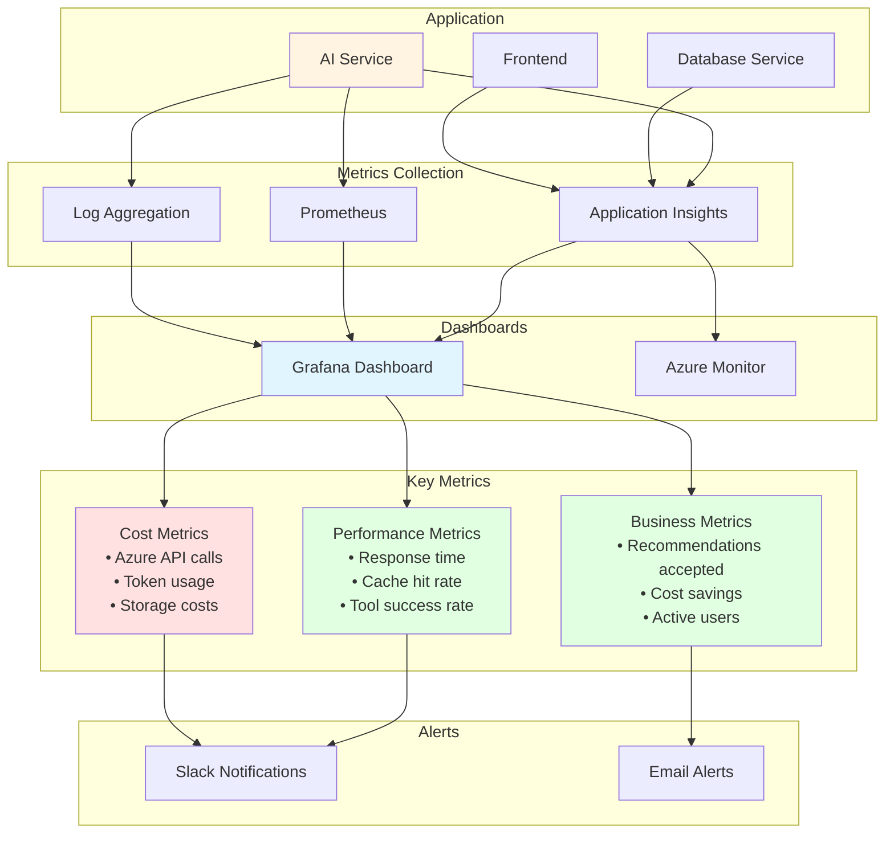

# Architecture Diagrams - Agentic AI System

## 1. Overall System Architecture

## 2. Data Flow - User Message to AI Response

## 3. Context Building Pipeline

## 4. Azure MCP Tool Discovery Flow

## 5. Hybrid Data Strategy

## 6. Function Calling Loop with Context

## 7. Cost Snapshot Background Job

## 8. Database Schema Relationships

## 9. Context7 RAG Integration Flow

## 10. Monitoring and Observability

---

## How to View These Diagrams

These diagrams use **Mermaid** syntax, which is supported by:

1. **GitHub** - View directly in the repository
2. **VS Code** - Install "Markdown Preview Mermaid Support" extension
3. **Mermaid Live Editor** - https://mermaid.live/
4. **Obsidian** - Built-in Mermaid support
5. **Notion** - Embed as code blocks

---

**Document Version:** 1.0  
**Last Updated:** October 31, 2025

