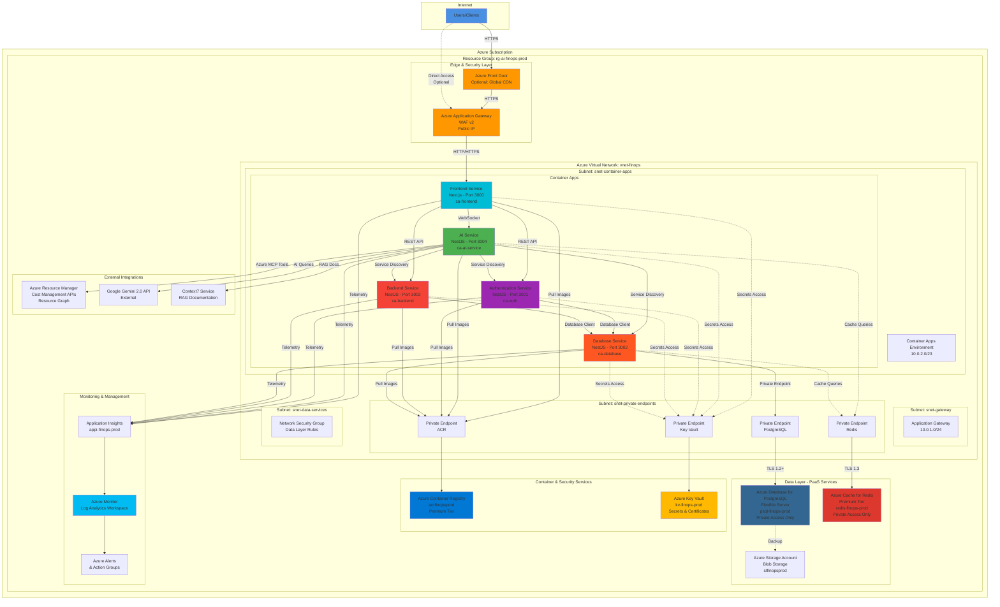
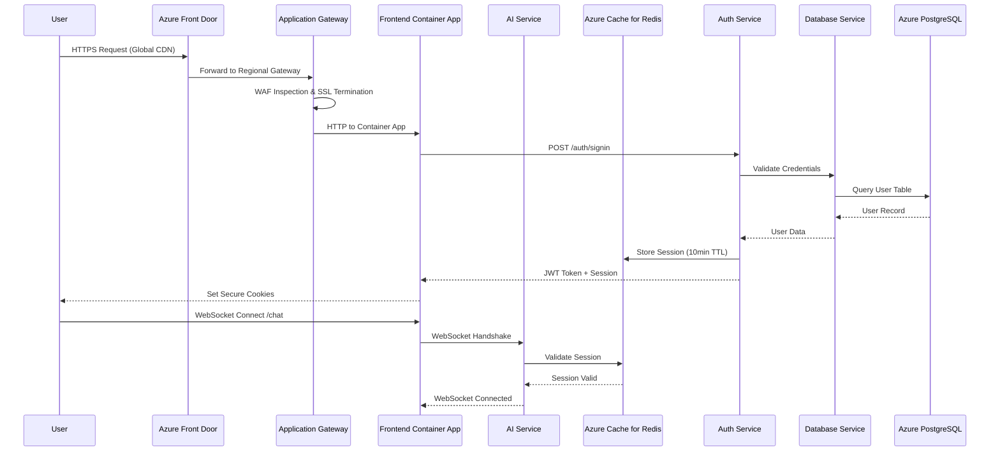
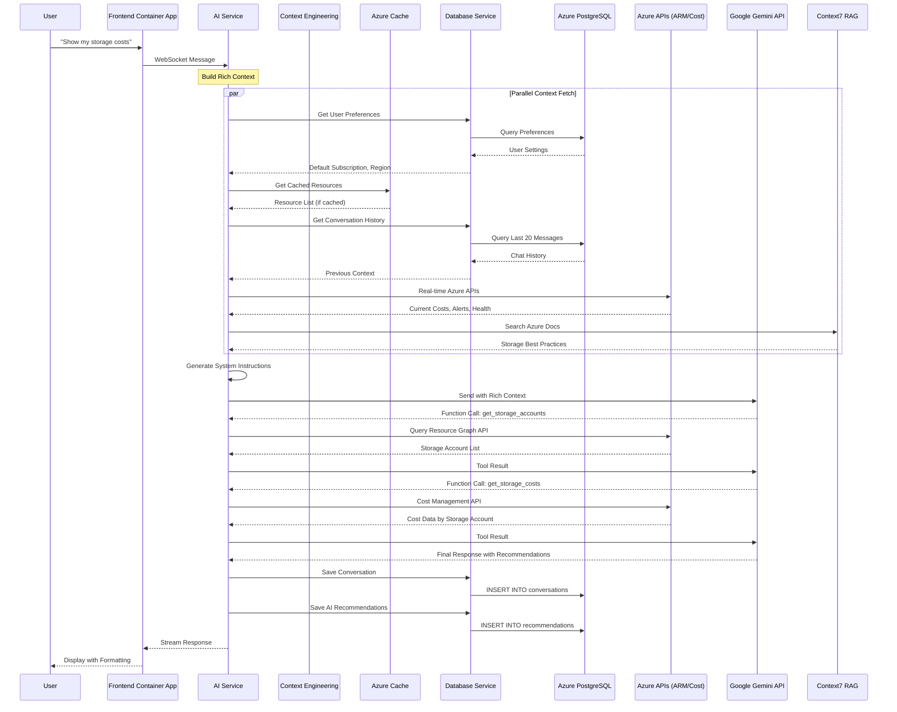

# Azure Cloud Deployment Architecture - AI for FinOps

## 📋 Executive Summary

This document provides a comprehensive Azure-specific deployment architecture for the **AI for FinOps** application. The architecture leverages Azure's native services to deploy a microservices-based application with high availability, security, and scalability.

**Target Azure Services:**
- **Azure Container Apps** - For all microservices (AI, Authentication, Backend, Database, Frontend)
- **Azure Database for PostgreSQL Flexible Server** - For persistent data storage
- **Azure Cache for Redis** - For session management and caching
- **Azure Virtual Network** - For secure network isolation
- **Azure Application Gateway** - For load balancing and WAF
- **Azure Key Vault** - For secrets management
- **Azure Monitor** - For observability and logging
- **Azure Container Registry** - For container image storage

---

## 🏗️ High-Level Azure Architecture



---

## 🔄 Detailed Service Communication Flow

### 1. User Request Flow (Frontend Access)



### 2. AI Chat Request Flow (Agentic AI)



---

## 🏗️ Azure Container Apps Environment Architecture

### Container Apps Environment Configuration

```yaml
# Azure Container Apps Environment
Name: cae-finops-prod
Location: East US 2
Tier: Consumption

Network Configuration:
  VNet Integration: Enabled
  Subnet: snet-container-apps (10.0.2.0/23)
  Internal Load Balancer: Enabled
  External Ingress: Through Application Gateway Only

Dapr Configuration:
  Enabled: true
  App ID: finops-services
  Components:
    - State Store (Redis)
    - Pub/Sub (Service Bus - Optional)
    - Service Invocation

Observability:
  Log Analytics Workspace: law-finops-prod
  Application Insights: appi-finops-prod
  Log Categories:
    - ContainerAppConsoleLogs
    - ContainerAppSystemLogs
    - AppEnvSpringAppConsoleLogs
```

### Individual Container App Configurations

#### 1. Frontend Container App (Next.js)

```yaml
Name: ca-frontend
Container Image: acrfinopsprod.azurecr.io/frontend:latest
Ingress:
  External: true (via App Gateway)
  Target Port: 3000
  Transport: HTTP
  Allow Insecure: false
  
Scaling:
  Min Replicas: 2
  Max Replicas: 10
  Rules:
    - Type: http
      Concurrent Requests: 100
    - Type: cpu
      Utilization: 70%

Resources:
  CPU: 0.5 cores
  Memory: 1.0 Gi

Environment Variables:
  - NEXT_PUBLIC_API_URL: https://api.finops.azure.com
  - NEXT_PUBLIC_WS_URL: wss://ai.finops.azure.com/chat
  - NODE_ENV: production

Secrets (from Key Vault):
  - AUTH_SECRET
  - GITHUB_CLIENT_ID
  - GITHUB_CLIENT_SECRET

Health Probes:
  Liveness: /api/health
  Readiness: /api/ready
  Startup: /api/startup
```

#### 2. AI Service Container App (NestJS)

```yaml
Name: ca-ai-service
Container Image: acrfinopsprod.azurecr.io/ai:latest
Ingress:
  External: true (WebSocket via App Gateway)
  Target Port: 3004
  Transport: HTTP2
  Allow Insecure: false
  Session Affinity: Sticky

Scaling:
  Min Replicas: 3
  Max Replicas: 20
  Rules:
    - Type: http
      Concurrent Requests: 50
    - Type: memory
      Utilization: 75%

Resources:
  CPU: 1.0 cores
  Memory: 2.0 Gi

Environment Variables:
  - GEMINI_API_ENDPOINT: https://generativelanguage.googleapis.com
  - REDIS_HOST: redis-finops-prod.redis.cache.windows.net
  - REDIS_PORT: 6380
  - REDIS_TLS: true
  - DATABASE_SERVICE_URL: http://ca-database
  - AZURE_TENANT_ID: ${KEY_VAULT_SECRET}
  - AZURE_SUBSCRIPTION_ID: ${KEY_VAULT_SECRET}

Managed Identity:
  System Assigned: Enabled
  User Assigned: mi-finops-ai-service
  
Permissions:
  - Azure Resource Graph: Reader
  - Azure Cost Management: Cost Management Reader
  - Key Vault: Secrets Get/List

Secrets (from Key Vault):
  - GEMINI_API_KEY
  - REDIS_PASSWORD
  - AZURE_CLIENT_SECRET
  - CONTEXT7_API_KEY

Dapr:
  Enabled: true
  App ID: ai-service
  App Port: 3004
```

#### 3. Authentication Service Container App

```yaml
Name: ca-auth
Container Image: acrfinopsprod.azurecr.io/authentication:latest
Ingress:
  External: false (Internal Only)
  Target Port: 3001
  Transport: HTTP

Scaling:
  Min Replicas: 2
  Max Replicas: 8
  Rules:
    - Type: http
      Concurrent Requests: 200

Resources:
  CPU: 0.5 cores
  Memory: 1.0 Gi

Environment Variables:
  - DATABASE_SERVICE_URL: http://ca-database
  - REDIS_HOST: redis-finops-prod.redis.cache.windows.net
  - JWT_EXPIRATION: 1h
  - REFRESH_TOKEN_EXPIRATION: 7d

Secrets (from Key Vault):
  - JWT_SECRET
  - REDIS_PASSWORD
  - GITHUB_OAUTH_SECRET
```

#### 4. Backend Service Container App

```yaml
Name: ca-backend
Container Image: acrfinopsprod.azurecr.io/backend:latest
Ingress:
  External: false (Internal Only)
  Target Port: 3003
  Transport: HTTP

Scaling:
  Min Replicas: 2
  Max Replicas: 12
  Rules:
    - Type: http
      Concurrent Requests: 150
    - Type: cpu
      Utilization: 70%

Resources:
  CPU: 0.75 cores
  Memory: 1.5 Gi

Environment Variables:
  - DATABASE_SERVICE_URL: http://ca-database
  - AZURE_RESOURCE_GRAPH_ENDPOINT: https://management.azure.com

Managed Identity:
  System Assigned: Enabled
  
Permissions:
  - Azure Resource Manager: Reader (Subscription Level)
  - Azure Cost Management: Cost Management Reader

Scheduled Jobs:
  - Name: cost-snapshot-job
    Schedule: "0 */6 * * *" # Every 6 hours
    Container: cost-snapshot-worker
```

#### 5. Database Service Container App

```yaml
Name: ca-database
Container Image: acrfinopsprod.azurecr.io/database:latest
Ingress:
  External: false (Internal Only)
  Target Port: 3002
  Transport: HTTP

Scaling:
  Min Replicas: 2
  Max Replicas: 6
  Rules:
    - Type: http
      Concurrent Requests: 300

Resources:
  CPU: 0.75 cores
  Memory: 1.5 Gi

Environment Variables:
  - DATABASE_URL: postgresql://psql-finops-prod.postgres.database.azure.com/finops
  - POSTGRES_USER: finops_admin
  - POSTGRES_SSL_MODE: require
  - CONNECTION_POOL_SIZE: 50

Secrets (from Key Vault):
  - POSTGRES_PASSWORD

Init Container:
  - Name: prisma-migrate
    Image: acrfinopsprod.azurecr.io/database:latest
    Command: ["npx", "prisma", "migrate", "deploy"]
```

---

## 🗄️ Azure Database for PostgreSQL Flexible Server

### PostgreSQL Configuration

```yaml
Server Name: psql-finops-prod.postgres.database.azure.com
Tier: General Purpose
Compute: Standard_D4s_v3 (4 vCores, 16 GB RAM)
Storage: 256 GB (Auto-grow enabled, Max: 16 TB)
Backup: 
  Retention: 35 days
  Geo-Redundant: Enabled
  Point-in-Time Restore: Enabled

High Availability:
  Mode: Zone-Redundant
  Standby Zone: Different from Primary
  Automatic Failover: Enabled

Networking:
  Public Access: Disabled
  Private Endpoint: Enabled
    - VNet: vnet-finops
    - Subnet: snet-private-endpoints
    - Private DNS Zone: privatelink.postgres.database.azure.com
  
Connection Security:
  SSL Enforcement: Required (TLS 1.2+)
  Minimum TLS Version: 1.2
  
Firewall Rules: None (Private Endpoint Only)

Server Parameters:
  max_connections: 500
  shared_buffers: 4GB
  effective_cache_size: 12GB
  maintenance_work_mem: 2GB
  checkpoint_completion_target: 0.9
  wal_buffers: 16MB
  default_statistics_target: 100
  random_page_cost: 1.1
  effective_io_concurrency: 200
  work_mem: 20MB
  min_wal_size: 1GB
  max_wal_size: 4GB

Extensions Enabled:
  - uuid-ossp
  - pgcrypto
  - pg_stat_statements
  - pg_trgm
  - btree_gin
  - btree_gist
```

### Database Schema (via Prisma)

```prisma
// Tables managed by Database Service
// Located at: database/prisma/schema.prisma

datasource db {
  provider = "postgresql"
  url      = env("DATABASE_URL")
}

// User Management
model User {
  id                    String    @id @default(uuid())
  email                 String    @unique
  passwordHash          String?
  name                  String?
  githubId              String?   @unique
  defaultSubscription   String?
  defaultRegion         String?
  createdAt             DateTime  @default(now())
  updatedAt             DateTime  @updatedAt
  
  sessions              Session[]
  conversations         Conversation[]
  recommendations       Recommendation[]
}

// Chat & Conversations
model Conversation {
  id                    String    @id @default(uuid())
  userId                String
  title                 String?
  createdAt             DateTime  @default(now())
  updatedAt             DateTime  @updatedAt
  
  user                  User      @relation(fields: [userId], references: [id])
  messages              Message[]
  contextSnapshots      ContextSnapshot[]
}

// Azure Resources Cache (Periodically synced)
model AzureResource {
  id                    String    @id @default(uuid())
  resourceId            String    @unique
  name                  String
  type                  String
  location              String
  subscriptionId        String
  resourceGroup         String
  tags                  Json?
  properties            Json?
  lastSyncedAt          DateTime  @default(now())
  
  @@index([subscriptionId])
  @@index([resourceGroup])
  @@index([type])
}

// Cost Snapshots (Background Job)
model CostSnapshot {
  id                    String    @id @default(uuid())
  subscriptionId        String
  resourceGroup         String?
  resourceId            String?
  date                  DateTime
  cost                  Decimal   @db.Decimal(18, 2)
  currency              String    @default("USD")
  createdAt             DateTime  @default(now())
  
  @@index([subscriptionId, date])
  @@index([resourceId, date])
}
```

---

## 🔴 Azure Cache for Redis Configuration

### Redis Instance Configuration

```yaml
Name: redis-finops-prod.redis.cache.windows.net
Tier: Premium P1
Capacity: 6 GB
Redis Version: 6.x

Features:
  Data Persistence: RDB (Redis Database Backup)
    - Frequency: Every 15 minutes
    - Storage Account: stfinopsprod
  
  Clustering: Disabled (Single Shard)
  Zone Redundancy: Enabled
  
  Replication: Standard (Primary + Replica)
  
Networking:
  Public Network Access: Disabled
  Private Endpoint: Enabled
    - VNet: vnet-finops
    - Subnet: snet-private-endpoints
    - Private DNS: privatelink.redis.cache.windows.net

TLS:
  Minimum TLS Version: 1.3
  Non-TLS Port: Disabled

Access Keys:
  Primary Key: Stored in Key Vault
  Secondary Key: Stored in Key Vault (for rotation)

Firewall: None (Private Endpoint Only)

Maxmemory Policy: allkeys-lru

Connection Settings:
  Max Clients: 10,000
  Connection Timeout: 30s
  
Advanced Settings:
  notify-keyspace-events: Ex
  timeout: 300
```

### Redis Usage Patterns

```typescript
// 1. Session Storage (Authentication Service)
Key Pattern: session:{userId}:{sessionId}
TTL: 600 seconds (10 minutes)
Data: JSON string with user session data

Example:
session:user-123:abc-def-ghi
Value: {
  "userId": "user-123",
  "email": "user@example.com",
  "defaultSub": "sub-456",
  "roles": ["user"],
  "exp": 1699999999
}

// 2. Azure Resource Cache (Backend/AI Service)
Key Pattern: azure:resources:{subscriptionId}
TTL: 600 seconds (10 minutes)
Data: JSON array of resources

Example:
azure:resources:sub-12345
Value: [
  {
    "id": "/subscriptions/.../resourceGroups/...",
    "name": "vm-prod-1",
    "type": "Microsoft.Compute/virtualMachines",
    "location": "eastus"
  }
]

// 3. API Schema Cache (AI Service MCP)
Key Pattern: mcp:schema:{toolName}
TTL: 86400 seconds (24 hours)
Data: JSON tool schema

Example:
mcp:schema:azure_resource_graph
Value: {
  "name": "query_resource_graph",
  "description": "...",
  "parameters": {...}
}

// 4. Context7 Documentation Cache (AI Service)
Key Pattern: context7:docs:{libraryId}:{topic}
TTL: 3600 seconds (1 hour)
Data: Markdown documentation

Example:
context7:docs:azure-storage:costs
Value: "# Azure Storage Costs\n\nBest practices..."

// 5. Rate Limiting (All Services)
Key Pattern: ratelimit:{service}:{userId}:{endpoint}
TTL: 60 seconds (1 minute)
Data: Request count

Example:
ratelimit:ai:user-123:/chat
Value: 10 (requests in current minute)
```

---

## 🔐 Azure Key Vault Configuration

### Key Vault Setup

```yaml
Name: kv-finops-prod
Tier: Standard (or Premium for HSM)
Location: East US 2

Networking:
  Public Access: Disabled
  Private Endpoint: Enabled
    - VNet: vnet-finops
    - Subnet: snet-private-endpoints
    - Private DNS: privatelink.vaultcore.azure.net

Access Policies: Disabled (Using RBAC)

RBAC Assignments:
  - Principal: ca-ai-service (Managed Identity)
    Role: Key Vault Secrets User
    Scope: All secrets
  
  - Principal: ca-auth (Managed Identity)
    Role: Key Vault Secrets User
    Scope: Specific secrets (JWT_SECRET, GITHUB_OAUTH_SECRET)
  
  - Principal: ca-database (Managed Identity)
    Role: Key Vault Secrets User
    Scope: Specific secrets (POSTGRES_PASSWORD)
  
  - Principal: DevOps Service Principal
    Role: Key Vault Secrets Officer
    Scope: All secrets (for CI/CD)

Soft Delete: Enabled (90 days retention)
Purge Protection: Enabled
```

### Secrets Stored in Key Vault

```yaml
Secrets:
  # Authentication
  - Name: JWT-SECRET
    Value: <random-256-bit-key>
    Content Type: application/x-secret
    
  - Name: GITHUB-CLIENT-SECRET
    Value: <github-oauth-secret>
    Content Type: application/x-oauth-secret
  
  # Database
  - Name: POSTGRES-PASSWORD
    Value: <strong-password>
    Content Type: application/x-password
    Rotation: Enabled (90 days)
  
  # Redis
  - Name: REDIS-PRIMARY-KEY
    Value: <redis-access-key>
    Content Type: application/x-access-key
    Rotation: Enabled (180 days)
  
  # AI Service
  - Name: GEMINI-API-KEY
    Value: <google-gemini-key>
    Content Type: application/x-api-key
  
  - Name: CONTEXT7-API-KEY
    Value: <context7-service-key>
    Content Type: application/x-api-key
  
  # Azure Service Principal (for MCP)
  - Name: AZURE-CLIENT-ID
    Value: <app-registration-client-id>
    Content Type: application/x-client-id
  
  - Name: AZURE-CLIENT-SECRET
    Value: <app-registration-secret>
    Content Type: application/x-client-secret
    Rotation: Enabled (90 days)
  
  - Name: AZURE-TENANT-ID
    Value: <azure-tenant-id>
    Content Type: text/plain
  
  # Frontend
  - Name: NEXTAUTH-SECRET
    Value: <nextauth-random-secret>
    Content Type: application/x-secret

Certificates:
  - Name: finops-azure-com
    Type: TLS/SSL Certificate
    Source: Let's Encrypt (Auto-renewal via App Gateway)
    Key Type: RSA 2048
    Subject: CN=finops.azure.com, CN=*.finops.azure.com
```

---

## 🌐 Azure Networking Architecture

### Virtual Network Configuration

```yaml
Virtual Network: vnet-finops
Address Space: 10.0.0.0/16
Location: East US 2
DNS Servers: Azure-provided DNS

Subnets:
  1. snet-gateway:
      Address: 10.0.1.0/24
      Purpose: Application Gateway
      Service Endpoints: None
      Delegation: None
      NSG: nsg-gateway
  
  2. snet-container-apps:
      Address: 10.0.2.0/23 (512 IPs)
      Purpose: Container Apps Environment
      Service Endpoints: 
        - Microsoft.Sql
        - Microsoft.Storage
      Delegation: Microsoft.App/environments
      NSG: nsg-container-apps
  
  3. snet-private-endpoints:
      Address: 10.0.4.0/24
      Purpose: Private Endpoints
      Service Endpoints: None
      Delegation: None
      NSG: nsg-private-endpoints
      Private Endpoint Network Policies: Disabled
  
  4. snet-data-services:
      Address: 10.0.5.0/24
      Purpose: Reserved for future data services
      Service Endpoints:
        - Microsoft.Sql
        - Microsoft.Storage
        - Microsoft.KeyVault
      Delegation: None
      NSG: nsg-data-services

Network Security Groups:
  nsg-gateway:
    Inbound Rules:
      - Priority: 100
        Name: Allow-HTTPS-Internet
        Source: Internet
        Destination: 10.0.1.0/24
        Port: 443
        Protocol: TCP
        Action: Allow
      
      - Priority: 110
        Name: Allow-HTTP-Internet-Redirect
        Source: Internet
        Destination: 10.0.1.0/24
        Port: 80
        Protocol: TCP
        Action: Allow
      
      - Priority: 120
        Name: Allow-Gateway-Manager
        Source: GatewayManager
        Destination: *
        Port: 65200-65535
        Protocol: TCP
        Action: Allow
    
    Outbound Rules:
      - Priority: 100
        Name: Allow-Container-Apps
        Source: 10.0.1.0/24
        Destination: 10.0.2.0/23
        Port: *
        Protocol: *
        Action: Allow
  
  nsg-container-apps:
    Inbound Rules:
      - Priority: 100
        Name: Allow-From-Gateway
        Source: 10.0.1.0/24
        Destination: 10.0.2.0/23
        Port: 443,80,3000-3004
        Protocol: TCP
        Action: Allow
      
      - Priority: 110
        Name: Allow-Inter-Service
        Source: 10.0.2.0/23
        Destination: 10.0.2.0/23
        Port: *
        Protocol: *
        Action: Allow
    
    Outbound Rules:
      - Priority: 100
        Name: Allow-To-Private-Endpoints
        Source: 10.0.2.0/23
        Destination: 10.0.4.0/24
        Port: *
        Protocol: *
        Action: Allow
      
      - Priority: 110
        Name: Allow-Internet-Outbound
        Source: 10.0.2.0/23
        Destination: Internet
        Port: 443
        Protocol: TCP
        Action: Allow

Private DNS Zones:
  - privatelink.postgres.database.azure.com
    Linked to: vnet-finops
    A Records: psql-finops-prod
  
  - privatelink.redis.cache.windows.net
    Linked to: vnet-finops
    A Records: redis-finops-prod
  
  - privatelink.vaultcore.azure.net
    Linked to: vnet-finops
    A Records: kv-finops-prod
  
  - privatelink.azurecr.io
    Linked to: vnet-finops
    A Records: acrfinopsprod
```

### Azure Application Gateway Configuration

```yaml
Name: agw-finops-prod
SKU: WAF_v2
Tier: WAF_v2
Capacity:
  Min: 2
  Max: 10
  Autoscale: Enabled

Public IP:
  Name: pip-agw-finops
  SKU: Standard
  Allocation: Static
  DNS Label: finops-prod

Frontend Configuration:
  Frontend IP: Public IP (pip-agw-finops)
  Frontend Ports:
    - Port 80 (HTTP - Redirect to HTTPS)
    - Port 443 (HTTPS)

Backend Pools:
  - Name: pool-frontend
    Targets:
      - FQDN: ca-frontend.internal.cae-finops-prod.eastus2.azurecontainerapps.io
    
  - Name: pool-ai-service
    Targets:
      - FQDN: ca-ai-service.internal.cae-finops-prod.eastus2.azurecontainerapps.io

HTTP Settings:
  - Name: https-settings-frontend
    Protocol: HTTPS
    Port: 443
    Cookie Affinity: Disabled
    Connection Draining: Enabled (30s)
    Request Timeout: 30s
    Host Name Override: Enabled (from backend)
    Probe: probe-frontend
  
  - Name: https-settings-ai
    Protocol: HTTPS
    Port: 443
    Cookie Affinity: Enabled (for WebSocket)
    Connection Draining: Enabled (60s)
    Request Timeout: 120s
    Host Name Override: Enabled (from backend)
    Probe: probe-ai

Health Probes:
  - Name: probe-frontend
    Protocol: HTTPS
    Host: ca-frontend.internal.cae-finops-prod.eastus2.azurecontainerapps.io
    Path: /api/health
    Interval: 30s
    Timeout: 30s
    Unhealthy Threshold: 3
  
  - Name: probe-ai
    Protocol: HTTPS
    Host: ca-ai-service.internal.cae-finops-prod.eastus2.azurecontainerapps.io
    Path: /health
    Interval: 30s
    Timeout: 30s
    Unhealthy Threshold: 3

Listeners:
  - Name: listener-https-frontend
    Frontend IP: Public
    Port: 443
    Protocol: HTTPS
    SSL Certificate: finops-azure-com (from Key Vault)
    Host Name: finops.azure.com
  
  - Name: listener-https-ai
    Frontend IP: Public
    Port: 443
    Protocol: HTTPS
    SSL Certificate: finops-azure-com (from Key Vault)
    Host Name: ai.finops.azure.com
  
  - Name: listener-http-redirect
    Frontend IP: Public
    Port: 80
    Protocol: HTTP

Routing Rules:
  - Name: rule-frontend
    Listener: listener-https-frontend
    Backend Pool: pool-frontend
    HTTP Settings: https-settings-frontend
    Rule Type: Basic
  
  - Name: rule-ai
    Listener: listener-https-ai
    Backend Pool: pool-ai-service
    HTTP Settings: https-settings-ai
    Rule Type: Basic
  
  - Name: rule-http-redirect
    Listener: listener-http-redirect
    Redirect Type: Permanent
    Target Listener: listener-https-frontend

WAF Configuration:
  Mode: Prevention
  Rule Set: OWASP 3.2
  File Upload Limit: 100 MB
  Max Request Body Size: 128 KB
  
  Custom Rules:
    - Name: RateLimit-Per-IP
      Priority: 10
      Rule Type: RateLimitRule
      Action: Block
      Match Conditions:
        - Remote Address
      Rate Limit: 100 requests per minute
    
    - Name: Block-Malicious-IPs
      Priority: 20
      Rule Type: MatchRule
      Action: Block
      Match Conditions:
        - Source IP in Threat Intelligence List

SSL Policy:
  Policy Type: Predefined
  Policy Name: AppGwSslPolicy20220101
  Min Protocol Version: TLSv1.2
  Cipher Suites:
    - TLS_ECDHE_RSA_WITH_AES_256_GCM_SHA384
    - TLS_ECDHE_RSA_WITH_AES_128_GCM_SHA256
```

---

## 📊 Azure Monitor & Observability

### Log Analytics Workspace

```yaml
Name: law-finops-prod
Location: East US 2
Retention: 90 days
Daily Cap: 10 GB

Data Sources:
  - Container Apps Console Logs
  - Container Apps System Logs
  - Application Insights Telemetry
  - PostgreSQL Server Logs
  - Redis Cache Diagnostics
  - Application Gateway Access Logs
  - NSG Flow Logs

Diagnostic Settings:
  PostgreSQL:
    Logs:
      - PostgreSQLLogs
      - PostgreSQLFlexDatabaseXacts
      - PostgreSQLFlexQueryStoreRuntime
    Metrics:
      - AllMetrics
  
  Redis Cache:
    Logs:
      - ConnectedClientList
    Metrics:
      - AllMetrics
  
  Application Gateway:
    Logs:
      - ApplicationGatewayAccessLog
      - ApplicationGatewayPerformanceLog
      - ApplicationGatewayFirewallLog
    Metrics:
      - AllMetrics
```

### Application Insights Configuration

```yaml
Name: appi-finops-prod
Type: Workspace-based
Connected Workspace: law-finops-prod

Instrumentation:
  - Frontend: @microsoft/applicationinsights-web (Browser)
  - AI Service: applicationinsights (Node.js SDK)
  - Auth Service: applicationinsights (Node.js SDK)
  - Backend Service: applicationinsights (Node.js SDK)
  - Database Service: applicationinsights (Node.js SDK)

Sampling:
  Type: Adaptive
  Target: 5 events per second
  Max TelemetryItemsPerSecond: 20

Features Enabled:
  - Live Metrics
  - Application Map
  - Transaction Search
  - Availability Tests
  - Performance Profiler
  - Snapshot Debugger (Premium)

Custom Metrics:
  - AI Chat Response Time
  - Azure API Call Latency
  - Context Building Duration
  - WebSocket Connection Count
  - Active User Sessions
  - Gemini API Token Usage
  - Cache Hit Ratio

Alerts:
  - High Response Time (>3s for 5 min)
  - Error Rate Spike (>5% for 5 min)
  - Low Availability (<99% for 5 min)
  - High Memory Usage (>85% for 10 min)
  - Failed Dependencies (>10% for 5 min)
```

### Azure Alerts & Action Groups

```yaml
Action Groups:
  - Name: ag-finops-critical
    Short Name: Critical
    Actions:
      - Email: devops@finops.com
      - SMS: +1-555-0100
      - Azure Function: fn-incident-handler
      - Webhook: https://slack.com/webhook/critical-alerts
  
  - Name: ag-finops-warning
    Short Name: Warning
    Actions:
      - Email: devops@finops.com
      - Teams Channel: FinOps Alerts

Alert Rules:
  - Name: alert-container-app-unhealthy
    Resource: Container Apps Environment
    Condition: Replica Health Status = Unhealthy
    Threshold: >0 for 5 minutes
    Severity: Critical (Sev 1)
    Action Group: ag-finops-critical
  
  - Name: alert-postgresql-cpu-high
    Resource: PostgreSQL Flexible Server
    Condition: CPU Percentage >85%
    Threshold: 10 minutes
    Severity: Warning (Sev 2)
    Action Group: ag-finops-warning
  
  - Name: alert-redis-memory-high
    Resource: Azure Cache for Redis
    Condition: Used Memory Percentage >90%
    Threshold: 5 minutes
    Severity: Critical (Sev 1)
    Action Group: ag-finops-critical
  
  - Name: alert-app-gateway-unhealthy-backend
    Resource: Application Gateway
    Condition: Unhealthy Host Count >0
    Threshold: 3 minutes
    Severity: Critical (Sev 1)
    Action Group: ag-finops-critical
  
  - Name: alert-gemini-api-failures
    Resource: Application Insights
    Condition: Custom Metric "GeminiAPIFailureRate" >10%
    Threshold: 5 minutes
    Severity: Warning (Sev 2)
    Action Group: ag-finops-warning
```

---

## 🔒 Security & Compliance Architecture

### Identity & Access Management

```yaml
Managed Identities:
  System-Assigned:
    - ca-ai-service
    - ca-auth
    - ca-backend
    - ca-database
    - ca-frontend
  
  User-Assigned:
    - mi-finops-ai-service (for Azure API access)
    - mi-finops-database (for PostgreSQL access)

Azure RBAC Assignments:
  # AI Service Identity
  - Principal: ca-ai-service (System)
    Role: Reader
    Scope: /subscriptions/{subscription-id}
  
  - Principal: mi-finops-ai-service (User)
    Role: Cost Management Reader
    Scope: /subscriptions/{subscription-id}
  
  - Principal: mi-finops-ai-service (User)
    Role: Monitoring Reader
    Scope: /subscriptions/{subscription-id}
  
  # Backend Service Identity
  - Principal: ca-backend (System)
    Role: Reader
    Scope: /subscriptions/{subscription-id}/resourceGroups/rg-ai-finops-prod
  
  # Database Service Identity
  - Principal: ca-database (System)
    Role: Key Vault Secrets User
    Scope: /subscriptions/{subscription-id}/resourceGroups/rg-ai-finops-prod/providers/Microsoft.KeyVault/vaults/kv-finops-prod
  
  # All Services
  - Principal: cae-finops-prod (Environment)
    Role: AcrPull
    Scope: /subscriptions/{subscription-id}/resourceGroups/rg-ai-finops-prod/providers/Microsoft.ContainerRegistry/registries/acrfinopsprod

Microsoft Entra ID Integration:
  App Registrations:
    - Name: finops-ai-service
      Purpose: Azure MCP API Access
      Permissions:
        - Microsoft Graph: User.Read (Delegated)
        - Azure Service Management: user_impersonation
      Secrets: Stored in Key Vault (AZURE-CLIENT-SECRET)
    
    - Name: finops-github-oauth
      Purpose: GitHub OAuth Integration
      Redirect URIs:
        - https://finops.azure.com/auth/callback/github
      Secrets: Stored in Key Vault (GITHUB-CLIENT-SECRET)
```

### Data Encryption

```yaml
Encryption at Rest:
  PostgreSQL:
    Method: Azure Storage Service Encryption (SSE)
    Key Management: Microsoft-Managed Keys
    TDE: Enabled (Transparent Data Encryption)
  
  Redis Cache:
    Method: Azure Storage Encryption
    Key Management: Microsoft-Managed Keys
  
  Azure Storage (Backups):
    Method: Azure Storage Service Encryption (SSE)
    Key Management: Microsoft-Managed Keys
    Customer-Managed Key: Optional (via Key Vault)

Encryption in Transit:
  All Services:
    - TLS 1.2+ enforced
    - TLS 1.3 preferred (where supported)
    - Certificate Management: Azure Key Vault
    - Certificate Renewal: Automatic (via App Gateway)
  
  Internal Service Communication:
    - Container Apps: mTLS via Dapr (optional)
    - PostgreSQL: SSL required mode
    - Redis: TLS 1.3 only
    - Key Vault: HTTPS with certificate pinning

Network Security:
  DDoS Protection: Standard (enabled on Public IP)
  WAF: Enabled on Application Gateway (Prevention mode)
  Private Link: Enabled for all PaaS services
  NSG Flow Logs: Enabled (sent to Log Analytics)
  Service Endpoints: Enabled where Private Link not available
```

### Compliance & Governance

```yaml
Azure Policy Assignments:
  - Policy: Require TLS 1.2 minimum
    Scope: Resource Group
    Effect: Deny
  
  - Policy: Require Private Endpoint for PaaS
    Scope: Resource Group
    Effect: Audit
  
  - Policy: Allowed Locations
    Scope: Resource Group
    Parameters: ["eastus2", "westus2"]
    Effect: Deny
  
  - Policy: Require Tags
    Scope: Resource Group
    Parameters:
      Environment: Required
      CostCenter: Required
      Owner: Required
    Effect: Deny

Azure Blueprints:
  - Name: FinOps-Production-Environment
    Components:
      - Resource Group Assignment
      - Policy Assignments
      - RBAC Assignments
      - ARM Template: Network Infrastructure
      - ARM Template: PaaS Services

Microsoft Defender for Cloud:
  Tier: Standard (Enabled)
  Plans:
    - Azure App Service: Enabled
    - Azure SQL Database: Enabled
    - Azure Storage: Enabled
    - Key Vault: Enabled
    - Container Registries: Enabled
  
  Security Alerts: Enabled
  Secure Score Monitoring: Enabled
  Just-In-Time VM Access: N/A (no VMs)
  Adaptive Application Controls: N/A
  
  Regulatory Compliance:
    - Azure Security Benchmark: Enabled
    - PCI DSS 3.2.1: Enabled
    - ISO 27001: Enabled

Tags (Applied to all resources):
  Environment: Production
  Application: AI-for-FinOps
  CostCenter: Engineering
  Owner: devops@finops.com
  ManagedBy: Terraform
  BackupPolicy: Daily
  Criticality: High
```

---

## 🚀 Deployment & CI/CD Architecture

### Azure Container Registry

```yaml
Name: acrfinopsprod.azurecr.io
SKU: Premium
Location: East US 2

Features:
  Geo-Replication: Enabled
    - Primary: East US 2
    - Secondary: West US 2
  
  Content Trust: Enabled (Notary v2)
  Quarantine: Enabled
  Retention Policy: 30 days (untagged manifests)
  
  Vulnerability Scanning: Enabled (Microsoft Defender)
  Image Signing: Enabled (Azure Key Vault)

Networking:
  Public Access: Disabled
  Private Endpoint: Enabled
    - VNet: vnet-finops
    - Subnet: snet-private-endpoints
  
  Service Endpoint: Enabled (snet-container-apps)

Authentication:
  Admin User: Disabled
  Managed Identity: Enabled for Container Apps
  Service Principal: Enabled for CI/CD pipeline

Webhooks:
  - Name: webhook-container-apps-deploy
    URI: https://api-cicd.finops.com/deploy
    Actions: [push, delete]
    Scope: repository:frontend:*,repository:ai:*

Image Repositories:
  - frontend:latest, frontend:v1.0.0, frontend:sha-abc123
  - ai:latest, ai:v1.0.0, ai:sha-def456
  - authentication:latest, authentication:v1.0.0, authentication:sha-ghi789
  - backend:latest, backend:v1.0.0, backend:sha-jkl012
  - database:latest, database:v1.0.0, database:sha-mno345
```

### CI/CD Pipeline (GitHub Actions)

```yaml
name: Deploy to Azure Container Apps

on:
  push:
    branches: [main]
  pull_request:
    branches: [main]

env:
  AZURE_SUBSCRIPTION_ID: ${{ secrets.AZURE_SUBSCRIPTION_ID }}
  ACR_NAME: acrfinopsprod
  RESOURCE_GROUP: rg-ai-finops-prod
  CONTAINER_APP_ENV: cae-finops-prod

jobs:
  build-and-deploy-frontend:
    runs-on: ubuntu-latest
    steps:
      - name: Checkout code
        uses: actions/checkout@v4
      
      - name: Azure Login
        uses: azure/login@v1
        with:
          creds: ${{ secrets.AZURE_CREDENTIALS }}
      
      - name: Build and Push to ACR
        uses: azure/docker-login@v1
        with:
          login-server: ${{ env.ACR_NAME }}.azurecr.io
          username: ${{ secrets.ACR_USERNAME }}
          password: ${{ secrets.ACR_PASSWORD }}
      
      - name: Build Docker Image
        run: |
          cd frontend
          docker build -t ${{ env.ACR_NAME }}.azurecr.io/frontend:${{ github.sha }} .
          docker tag ${{ env.ACR_NAME }}.azurecr.io/frontend:${{ github.sha }} ${{ env.ACR_NAME }}.azurecr.io/frontend:latest
      
      - name: Push to ACR
        run: |
          docker push ${{ env.ACR_NAME }}.azurecr.io/frontend:${{ github.sha }}
          docker push ${{ env.ACR_NAME }}.azurecr.io/frontend:latest
      
      - name: Deploy to Container Apps
        uses: azure/container-apps-deploy-action@v1
        with:
          resourceGroup: ${{ env.RESOURCE_GROUP }}
          containerAppName: ca-frontend
          containerAppEnvironment: ${{ env.CONTAINER_APP_ENV }}
          imageToDeploy: ${{ env.ACR_NAME }}.azurecr.io/frontend:${{ github.sha }}
  
  # Similar jobs for ai, authentication, backend, database...
  
  run-integration-tests:
    needs: [build-and-deploy-frontend, build-and-deploy-ai, ...]
    runs-on: ubuntu-latest
    steps:
      - name: Run Integration Tests
        run: |
          npm run test:integration
      
      - name: Run E2E Tests
        run: |
          npx playwright test
  
  notify-deployment:
    needs: [run-integration-tests]
    runs-on: ubuntu-latest
    steps:
      - name: Send Teams Notification
        uses: aliencube/microsoft-teams-actions@v0.8.0
        with:
          webhook_uri: ${{ secrets.TEAMS_WEBHOOK }}
          message: "Deployment to Production successful!"
```

---

## 💰 Cost Optimization Strategy

### Azure Cost Estimate (Monthly)

```yaml
Compute (Container Apps):
  ca-frontend (2-10 replicas):
    Base: $50 - $250/month
    Average: ~$120/month
  
  ca-ai-service (3-20 replicas):
    Base: $150 - $1000/month
    Average: ~$450/month
  
  ca-auth (2-8 replicas):
    Base: $50 - $200/month
    Average: ~$100/month
  
  ca-backend (2-12 replicas):
    Base: $75 - $450/month
    Average: ~$200/month
  
  ca-database (2-6 replicas):
    Base: $75 - $225/month
    Average: ~$125/month
  
  Total Compute: ~$995/month

Database (PostgreSQL Flexible):
  Compute (General Purpose 4 vCore): ~$250/month
  Storage (256 GB): ~$40/month
  Backup Storage (35 days): ~$15/month
  High Availability: ~$250/month (standby)
  Total Database: ~$555/month

Cache (Redis Premium P1):
  Base: ~$250/month
  Data Persistence: ~$10/month
  Total Cache: ~$260/month

Networking:
  Application Gateway (WAF_v2): ~$300/month
  Public IP (Static): ~$4/month
  Private Endpoints (5x): ~$45/month
  Data Transfer (outbound): ~$50/month
  Total Networking: ~$399/month

Storage & Registry:
  Azure Container Registry (Premium): ~$30/month
  Storage Account (Backups): ~$20/month
  Total Storage: ~$50/month

Security & Management:
  Key Vault: ~$3/month
  Application Insights: ~$100/month
  Log Analytics (10GB/day): ~$250/month
  Azure Monitor Alerts: ~$10/month
  Total Security: ~$363/month

External Services:
  Google Gemini API: ~$200/month (estimated)
  Context7 Service: ~$50/month (estimated)
  Total External: ~$250/month

TOTAL ESTIMATED MONTHLY COST: ~$2,872/month
Annual Estimate: ~$34,464/year

Cost Optimization Tips:
  1. Use Azure Reservations for PostgreSQL (-40%)
  2. Use Azure Hybrid Benefit where applicable
  3. Implement autoscaling with appropriate min/max replicas
  4. Use spot instances for non-critical background jobs
  5. Set up budget alerts at 80% and 90% thresholds
  6. Review and delete unused resources monthly
  7. Use Azure Advisor recommendations
  8. Consider Consumption tier for Container Apps (if workload suitable)
```

---

## 📚 Deployment Checklist

### Pre-Deployment

- [ ] Azure Subscription created and verified
- [ ] Resource Group created: `rg-ai-finops-prod`
- [ ] Service Principal created for CI/CD
- [ ] GitHub repository secrets configured
- [ ] Domain name registered and DNS configured
- [ ] SSL certificate obtained (or use App Gateway managed)

### Infrastructure Deployment

- [ ] Virtual Network and Subnets created
- [ ] Network Security Groups configured
- [ ] Azure Container Registry deployed
- [ ] Azure Key Vault deployed and secrets added
- [ ] Azure PostgreSQL Flexible Server deployed
- [ ] Azure Cache for Redis deployed
- [ ] Private Endpoints created for all PaaS services
- [ ] Private DNS Zones created and linked
- [ ] Container Apps Environment created
- [ ] Application Gateway deployed and configured
- [ ] Azure Monitor workspace and App Insights created

### Application Deployment

- [ ] Database schema deployed (Prisma migrations)
- [ ] Container images built and pushed to ACR
- [ ] Container Apps deployed (all 5 services)
- [ ] Environment variables and secrets configured
- [ ] Managed identities assigned
- [ ] RBAC permissions granted
- [ ] Health probes verified
- [ ] Autoscaling rules configured

### Post-Deployment

- [ ] DNS records updated to point to Application Gateway
- [ ] SSL certificate validated
- [ ] WAF rules tested and fine-tuned
- [ ] Integration tests executed
- [ ] E2E tests executed
- [ ] Performance testing completed
- [ ] Security scanning completed
- [ ] Monitoring alerts configured and tested
- [ ] Backup and disaster recovery tested
- [ ] Documentation updated
- [ ] Runbook created for operations team

---

## 🔗 Additional Resources

### Azure Documentation
- [Azure Container Apps Documentation](https://learn.microsoft.com/en-us/azure/container-apps/)
- [Azure PostgreSQL Flexible Server](https://learn.microsoft.com/en-us/azure/postgresql/flexible-server/)
- [Azure Cache for Redis](https://learn.microsoft.com/en-us/azure/azure-cache-for-redis/)
- [Azure Application Gateway](https://learn.microsoft.com/en-us/azure/application-gateway/)
- [Azure Virtual Network](https://learn.microsoft.com/en-us/azure/virtual-network/)
- [Azure Monitor](https://learn.microsoft.com/en-us/azure/azure-monitor/)

### Architecture Patterns
- [Microservices with Azure Container Apps](https://learn.microsoft.com/en-us/azure/architecture/example-scenario/serverless/microservices-with-container-apps)
- [Azure Well-Architected Framework](https://learn.microsoft.com/en-us/azure/well-architected/)
- [Cloud Design Patterns](https://learn.microsoft.com/en-us/azure/architecture/patterns/)

### Security Best Practices
- [Azure Security Baseline for Container Apps](https://learn.microsoft.com/en-us/security/benchmark/azure/baselines/container-apps-security-baseline)
- [Network Security Best Practices](https://learn.microsoft.com/en-us/azure/security/fundamentals/network-best-practices)
- [Data Encryption in Azure](https://learn.microsoft.com/en-us/azure/security/fundamentals/encryption-overview)

---

**Document Version:** 1.0  
**Last Updated:** November 3, 2025  
**Author:** DevOps Team  
**Status:** Production Ready

**Review Schedule:** Quarterly  
**Next Review Date:** February 3, 2026
